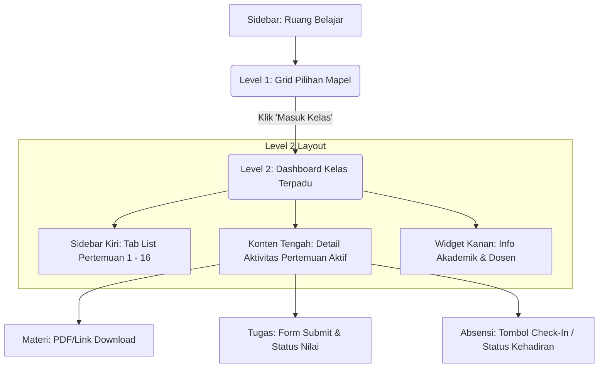
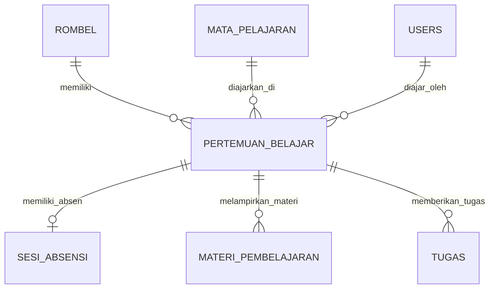

# Rancangan Arsitektur LMS: Ruang Belajar Multi-Level
> [!NOTE]
> Dokumen ini adalah rancangan arsitektur antarmuka dan basis data terpadu hasil diskusi untuk meningkatkan UX Warga Belajar (WB) menggunakan alur pembelajaran terstruktur berbasis Mata Pelajaran (Mapel) dan Pertemuan (LMS-Style).

---

## 1. Diagram Alur Pengguna (User Journey Flow)

Berikut adalah diagram bagaimana Warga Belajar mengakses materi, tugas, dan melakukan absensi:



---

## 2. Struktur Tampilan (UI/UX)

### LEVEL 1: Grid Pilihan Mapel (Halaman Utama Ruang Belajar)
Halaman awal yang menampilkan daftar semua mata pelajaran aktif yang diikuti oleh Warga Belajar sesuai dengan Rombel mereka.

*   **Desain**: Card-based grid dengan efek hover modern (glassmorphism/subtle gradient).
*   **Informasi pada Card**:
    *   Nama Mata Pelajaran & Kode Mapel (misal: *Sistem Basis Data - KS20251*)
    *   Foto & Nama Tutor / Pengampu
    *   Progress Ring/Bar (misal: *6 dari 16 pertemuan telah diterbitkan*)
    *   Status Ringkas (misal: *1 Tugas belum dikumpulkan*)
    *   Tombol **"Masuk Kelas →"**

---

### LEVEL 2: Halaman Kelas Terpadu (`/dashboard/siswa/kelas/:mapelId`)
Terinspirasi langsung oleh UI LMS premium modern, tampilan ini menyatukan semua interaksi akademik dalam satu layar dengan tata letak *split-pane* (3 bagian):

```text
+--------------------------------------------------------------------------------------------------+
|  [Koran Banner] Kelas Sistem Basis Data (KS20251)                                                |
|  Tutor: Rohmat Nur Ibrahim, M.T. | Kehadiran: 4/16 | Submitted Tugas: 0/1 | Total Sesi: 16       |
+------------------------------------------------------+-------------------------------------------+
| TAB PERTEMUAN (Kiri)  | KONTEN UTAMA (Tengah)        | WIDGET INFORMASI (Kanan)                  |
+-----------------------+------------------------------+-------------------------------------------+
| [Pertemuan 1]         | Pertemuan 1 - Pengenalan DB  | DOKUMEN RPS                               |
| [Pertemuan 2]  [*]    | tgl: 03 April 2026           | > RPS-Sistem Basis Data.pdf               |
| [Pertemuan 3]         |                              |                                           |
| [Pertemuan 4]         | 1. Rencana Materi            | RINGKASAN KEHADIRAN                       |
| [Pertemuan 5]         |    Mengenal dasar data...    | - Hadir: 4      - Sakit: 0                |
| [Pertemuan 6]         |                              | - Alfa:  0      - Izin:  0                |
| [Pertemuan 7]         | 2. Tugas Pertemuan           | [ Lihat Detail Presensi ]                 |
| [Pertemuan 8]         |    - Deskripsi & Deadline    |                                           |
| [Pertemuan 9]         |    - [ Choose File ] [Submit]| PENGUMUMAN                                |
| [Pertemuan 10]        |                              | "Ujian tengah semester akan diadakan..."  |
| [Pertemuan 11]        | 3. Materi Belajar            |                                           |
| [Pertemuan 12]        |    - Slide_01.pdf [Download] |                                           |
+-----------------------+------------------------------+-------------------------------------------+
```

#### A. Banner Utama (Header)
*   **Warna/Styling**: Gradient elegan dengan paduan warna biru tua (`#1E40AF`) ke cyan (`#06B6D4`).
*   **Isi**: Nama kelas, kode mapel, foto tutor/dosen, serta visualisasi indikator performa:
    *   *Tingkat Kehadiran*: Jumlah hadir dibanding total sesi berjalan.
    *   *Tugas Disubmit*: Rasio tugas terkumpul.
    *   *Total Pertemuan*: Jumlah sesi kelas sepanjang semester.

#### B. Sidebar Kiri: Tab List Pertemuan
*   Tersusun secara vertikal dari `Pertemuan 1` hingga `Pertemuan 16`.
*   Dilengkapi ikon atau badge indikator status:
    *   **Ikon Centang Hijau**: Jika absensi sudah terekam dan tugas (jika ada) sudah dinilai/dikumpulkan.
    *   **Badge Merah/Kuning `[*]`**: Pertemuan aktif minggu ini yang membutuhkan perhatian (belum absen/ada tugas deadline dekat).

#### C. Konten Tengah: Detail Aktivitas Pertemuan
Menampilkan data spesifik dari pertemuan yang dipilih di sidebar kiri secara dinamis:
*   **Header Pertemuan**: Judul topik bahasan dan tanggal pelaksanaan.
*   **Rencana Materi / Kompetensi**: Ulasan singkat materi atau indikator pencapaian belajar.
*   **Tugas Pertemuan**:
    *   Nama Tugas, Deskripsi Instruksi, Batas Waktu (Deadline).
    *   Kolom status pengumpulan, nilai, dan komentar tutor.
    *   Formulir input pengumpulan tugas langsung di tempat (tidak perlu pindah halaman).
*   **Materi Belajar**: Daftar file slide, e-book, atau link video pengayaan dengan tautan unduhan langsung.
*   **Forum Diskusi Sesi** *(Opsional)*: Kolom komentar interaktif antar warga belajar dan tutor untuk sesi tersebut.

#### D. Widget Kanan: Informasi Tambahan
*   **Dokumen Rencana Pembelajaran (RPS/Syllabus)**: Memudahkan siswa mengunduh acuan kurikulum dalam satu semester.
*   **Ringkasan Kehadiran**: Statistik terperinci akumulasi kehadiran (Hadir, Sakit, Izin, Alfa).
*   **Pengumuman Kelas**: Pesan-pesan penting yang diposting oleh Tutor khusus untuk mata pelajaran ini.

---

## 3. Desain Skema Database Terintegrasi

Untuk mendukung modularitas ini tanpa memecah struktur database utama yang sudah berjalan:



### Tabel Baru: `pertemuan_belajar`
Tabel ini bertindak sebagai "jangkar" yang mengikat sesi absensi, materi, dan tugas.

```sql
CREATE TABLE IF NOT EXISTS pertemuan_belajar (
  id INT AUTO_INCREMENT PRIMARY KEY,
  rombel_id INT NOT NULL,
  mapel_id INT NOT NULL,
  tutor_id INT NOT NULL,
  pertemuan_ke INT NOT NULL, -- Pertemuan 1, 2, 3...
  judul VARCHAR(255) NOT NULL,
  rencana_materi TEXT NULL,
  metode_belajar ENUM('online', 'offline', 'hybrid') DEFAULT 'hybrid',
  tanggal_pelaksanaan DATE NOT NULL,
  is_published TINYINT(1) DEFAULT 0,
  created_at TIMESTAMP DEFAULT CURRENT_TIMESTAMP,
  updated_at TIMESTAMP DEFAULT CURRENT_TIMESTAMP ON UPDATE CURRENT_TIMESTAMP,
  FOREIGN KEY (rombel_id) REFERENCES rombel(id) ON DELETE CASCADE,
  FOREIGN KEY (mapel_id) REFERENCES mata_pelajaran(id) ON DELETE CASCADE,
  FOREIGN KEY (tutor_id) REFERENCES users(id) ON DELETE CASCADE,
  UNIQUE KEY unique_pertemuan (rombel_id, mapel_id, pertemuan_ke)
);
```

### Modifikasi Kolom (Jalur Migrasi Aman)
Kita cukup menambahkan kolom `pertemuan_id` yang bernilai `NULL` secara default pada tabel-tabel berikut:
```sql
ALTER TABLE sesi_absensi ADD COLUMN pertemuan_id INT NULL, ADD FOREIGN KEY (pertemuan_id) REFERENCES pertemuan_belajar(id) ON DELETE SET NULL;
ALTER TABLE materi_pembelajaran ADD COLUMN pertemuan_id INT NULL, ADD FOREIGN KEY (pertemuan_id) REFERENCES pertemuan_belajar(id) ON DELETE SET NULL;
ALTER TABLE tugas ADD COLUMN pertemuan_id INT NULL, ADD FOREIGN KEY (pertemuan_id) REFERENCES pertemuan_belajar(id) ON DELETE SET NULL;
```

---

## 4. Keuntungan UX Terintegrasi Ini
1.  **Satu Layar Untuk Semua Aksi**: Siswa tidak perlu lagi membuka menu "Tugas" lalu pindah ke menu "Materi" dan "Absensi Saya". Semua diproses di dalam ruang pertemuan yang relevan.
2.  **Kejelasan Akademik**: Adanya sidebar 1-16 pertemuan memberikan gambaran visual instan tentang progres materi yang sudah dipelajari dan tugas mana yang belum selesai dikerjakan.
3.  **Kemudahan Penilaian bagi Tutor**: Tutor dapat melihat pengumpulan tugas dan absensi Warga Belajar secara terstruktur per pertemuan.
